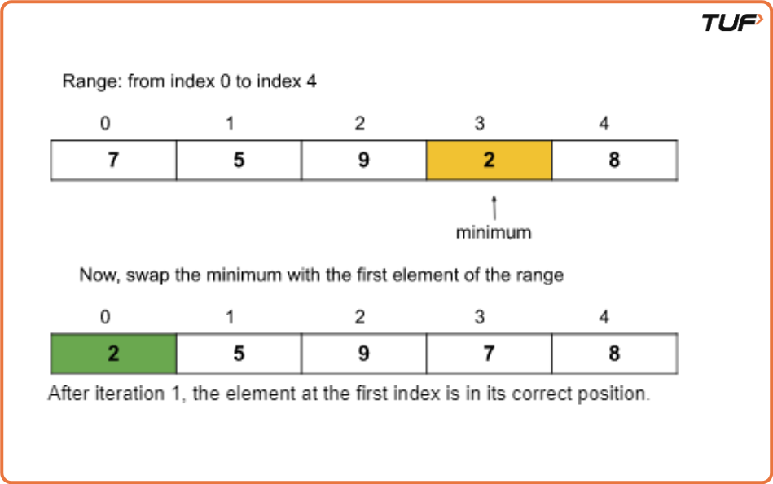
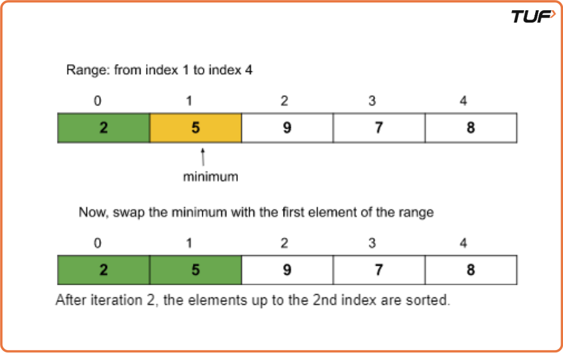
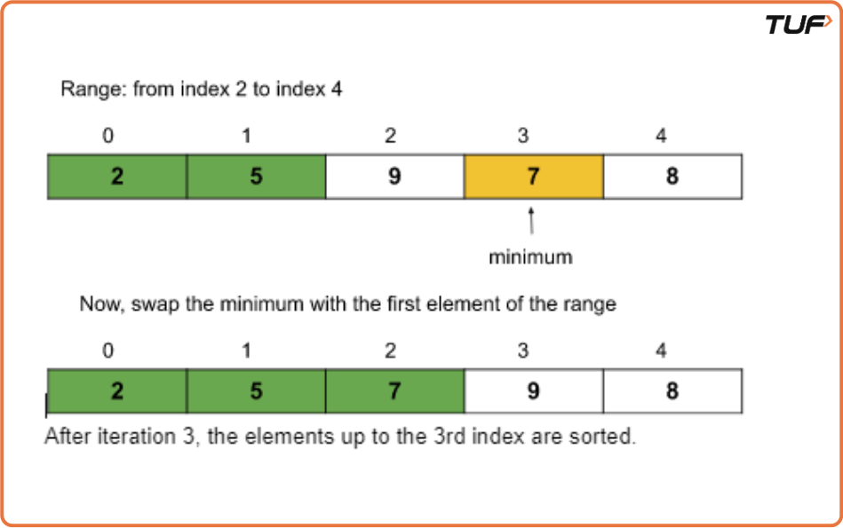
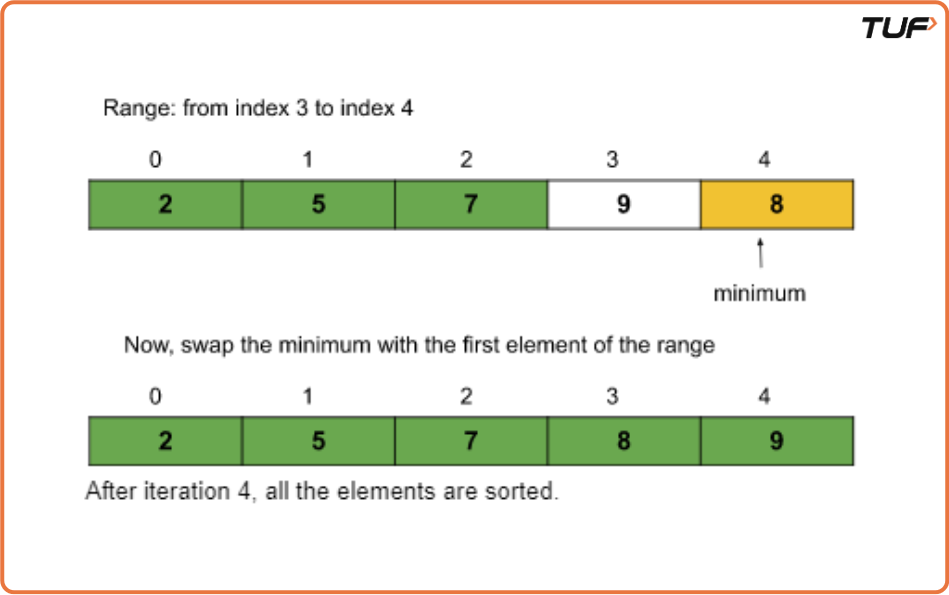

Selection Sort Algorithm

Approach
Algorithm
First, we will select the range of the unsorted array using a loop (say i) that indicates the starting index of the range. The loop will run forward from 0 to n-1. The value i = 0 means the range is from 0 to n-1, and similarly, i = 1 means the range is from 1 to n-1, and so on. (Initially, the range will be the whole array starting from the first index.)
Now, in each iteration, we will select the minimum element from the range of the unsorted array using an inner loop.
After that, we will swap the minimum element with the first element of the selected range(in step 1).
Finally, after each iteration, we will find that the array is sorted up to the first index of the range.

Dry Run  
Iteration 1:

Iteration 2:

Iteration 3:

Iteration 4:

So, after 4 iterations(i.e. n-1 iterations where n = size of the array), the given array is sorted.

Code

Java

public class SelectionSort {
// Function to perform selection sort
public static void selectionSort(int[] arr) {
int n = arr.length;

        // Traverse through all array elements
        for (int i = 0; i < n - 1; i++) {
            int minIndex = i; // Assume current index holds the minimum

            // Find the minimum element in the remaining array
            for (int j = i + 1; j < n; j++) {
                if (arr[j] < arr[minIndex]) {
                    minIndex = j; // Update minIndex if smaller is found
                }
            }

            // Swap the found minimum element with the first element of unsorted part
            int temp = arr[minIndex];
            arr[minIndex] = arr[i];
            arr[i] = temp;
        }

        // Print the sorted array
        System.out.println("After selection sort:");
        for (int num : arr) {
            System.out.print(num + " ");
        }
    }

    public static void main(String[] args) {
        int[] arr = {13, 46, 24, 52, 20, 9};

        // Print array before sorting
        System.out.println("Before selection sort:");
        for (int num : arr) {
            System.out.print(num + " ");
        }
        System.out.println();

        // Call selection sort
        selectionSort(arr);
    }
}

Complexity Analysis

Time Complexity:O(N^2),Selection sort runs in O(N²) time in the best, average, and worst cases due to its nested loop structure. It makes approximately N(N-1)/2 comparisons, regardless of the array's initial state. Even if no swaps are needed (best case), the number of comparisons remains the same./p>

Space Complexity: O(1). No extra space used
