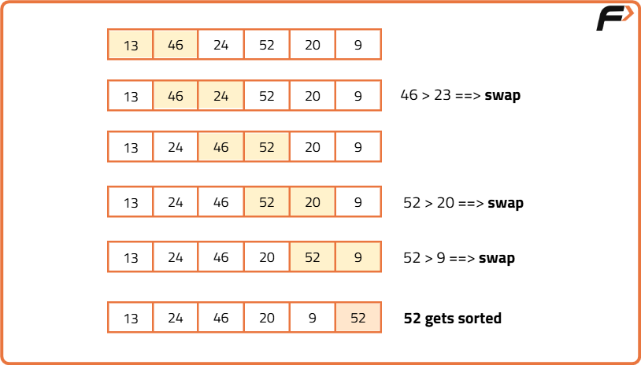

Bubble Sort Algorithm

Brute Force

Algorithm

Approach:

- Select the range of the unsorted array: Use an outer loop (i) that runs backward from n-1 to 0 (where n is the size of the array). The value i = n-1 means the range is from 0 to n-1, i = n-2 means the range is from 0 to n-2, and so on.
- Push the maximum element to the end of the selected range: Use an inner loop (j) that runs from 0 to i-1. Compare adjacent elements and swap them if arr[j] > arr[j+1]. Repeating this process ensures the maximum element in the current range moves to index i.
- Progressively sort the array: After each outer loop iteration, the last part of the array becomes sorted. For example:
  - After the first iteration, the element at the last index is sorted.
  - After the second iteration, the last two elements are sorted.
  - This continues until the entire array is sorted.
- Complete sorting: After n-1 iterations, the whole array will be sorted.

Note: After each iteration, the sorted portion grows from the end, so the last index of the unsorted range decreases by 1 (controlled by i). The inner loop (j) ensures the maximum element in the range [0…i] is placed at index i.

Dry Run

Image 1

Code

Java

import java.util.Arrays;

class BubbleSort {

    public void bubbleSort(int[] arr) {
        int n = arr.length;
        for (int i = n - 1; i >= 0; i--) {   //Use two nested loops to iterate over the array
            for (int j = 0; j <= i - 1; j++) {
                if (arr[j] > arr[j + 1]) {
                    int temp = arr[j + 1];
                    arr[j + 1] = arr[j];  //Swap arr[j+1] with arr[i];
                    arr[j] = temp;
                }
            }
        }
        System.out.println("After Using Bubble Sort:");
        for (int num : arr) {
            System.out.print(num + " ");
        }
        System.out.println();
    }

    public static void main(String[] args) {
        int[] arr = {13, 46, 24, 52, 20, 9};

        System.out.println("Before Using Bubble Sort:");
        for (int num : arr) {
            System.out.print(num + " ");
        }
        System.out.println();

        BubbleSort sorter = new BubbleSort();
        sorter.bubbleSort(arr);
    }
}

Complexity Analysis

- Time Complexity: O(N2), (where N = size of the array), for the worst, and average cases.
- Space Complexity: O(1).

Optimal Approach

Algorithm

Optimized approach

- The best case occurs if the given array is already sorted. We can reduce the time complexity to O(N) by just adding a small check inside the loops.
- We will check in the first iteration if any swap is taking place. If the array is already sorted no swap will occur and we will break out from the loops.
- Thus the iteration of the outer loop will be just 1. And our overall time complexity will be O(N).

Code

Java

class BubbleSort {
public void bubbleSort(int[] arr) {
int n = arr.length;
for (int i = n - 1; i >= 0; i--) {  //Use two nested loops to iterate over the array
boolean didSwap = false;
for (int j = 0; j <= i - 1; j++) {
if (arr[j] > arr[j + 1]) {
int temp = arr[j + 1];  //Swap arr[j+1] with arr[i]
arr[j + 1] = arr[j];
arr[j] = temp;
didSwap = true;
}
}
if (!didSwap) {
break;
}
}

        System.out.println("After Using Bubble Sort:");
        for (int num : arr) {
            System.out.print(num + " ");
        }
        System.out.println();
    }

    public static void main(String[] args) {
        int[] arr = {13, 46, 24, 52, 20, 9};

        System.out.println("Before Using Bubble Sort:");
        for (int num : arr) {
            System.out.print(num + " ");
        }
        System.out.println();

        BubbleSort sorter = new BubbleSort();
        sorter.bubbleSort(arr);
    }
}

Complexity Analysis
                        
Time Complexity:O(N2) for the worst and average cases and O(N) for the best case. Here, N = size of the array.
Space Complexity:O(1)
