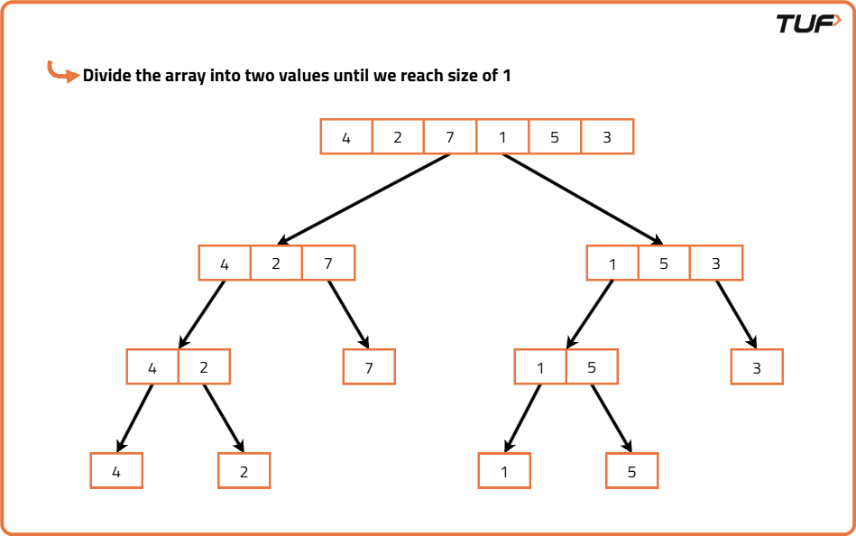
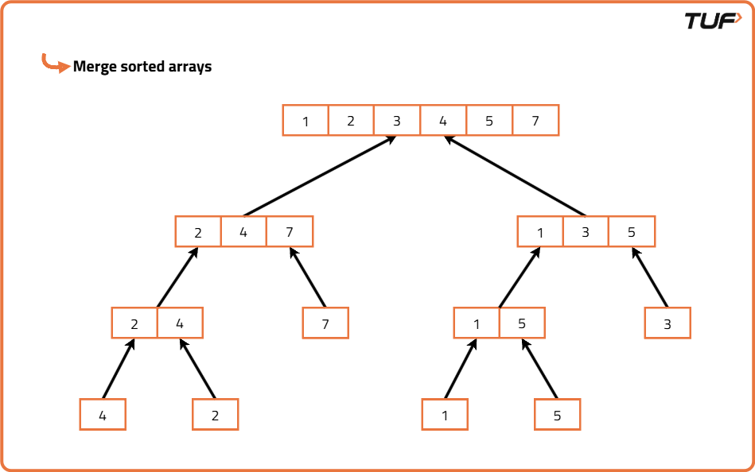

Merge Sort Algorithm

Problem Statement: Given an array of size n, sort the array using Merge Sort.

Algorithm

Merge Sort is a classic divide and conquer algorithm. The core idea is based on breaking down a big problem into smaller, manageable sub-problems i.e. sorting smaller arrays and then merging those solutions to get the final sorted result.

It is much easier to merge two sorted arrays than to sort a large unsorted one. Therefore, instead of trying to sort the entire array at once, Merge Sort breaks it into halves repeatedly until we reach arrays of size 1 (which are trivially sorted), and then merges them back in sorted order. This makes the algorithm efficient and predictable, especially for large datasets.
If the array has only one or zero elements, it is already sorted, so we return it as is.
Else, we divide the array into two halves by finding the middle index.
We then apply the merge sort algorithm recursively on each of the two halves to sort them individually.
Once we have two sorted halves, we need to merge them into a single sorted array.
To merge, we compare elements from both halves one by one and place the smaller element into a new array, continuing this until all elements from both halves are used.
This process is repeated at every level of recursion, and finally, we get one fully sorted array after all merges are complete.

Code

Java

import java.util.*;

class Solution {
// Function to merge two halves
public void merge(int[] arr, int low, int mid, int high) {
// Create temp array
List<Integer> temp = new ArrayList<>();
int left = low, right = mid + 1;

        // Merge both sorted parts
        while (left <= mid && right <= high) {
            if (arr[left] <= arr[right])
                temp.add(arr[left++]);
            else
                temp.add(arr[right++]);
        }

        // Add remaining left elements
        while (left <= mid)
            temp.add(arr[left++]);

        // Add remaining right elements
        while (right <= high)
            temp.add(arr[right++]);

        // Copy back to original array
        for (int i = low; i <= high; i++)
            arr[i] = temp.get(i - low);
    }

    // Recursive merge sort
    public void mergeSort(int[] arr, int low, int high) {
        if (low >= high)
            return;

        // Find mid index
        int mid = (low + high) / 2;

        // Sort left half
        mergeSort(arr, low, mid);

        // Sort right half
        mergeSort(arr, mid + 1, high);

        // Merge both halves
        merge(arr, low, mid, high);
    }
}

public class Main {
public static void main(String[] args) {
int[] arr = {5, 2, 8, 4, 1};
Solution sol = new Solution();
sol.mergeSort(arr, 0, arr.length - 1);
for (int num : arr)
System.out.print(num + " ");
System.out.println();
}
}

Complexity Analysis

Time Complexity: O(N*logN), merging two arrays take linear time and array is recursively divided into halves (logN times).
Space Complexity: O(N), we use a temporary array to store elements in sorted order.

