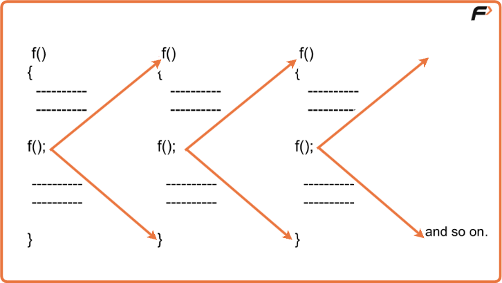
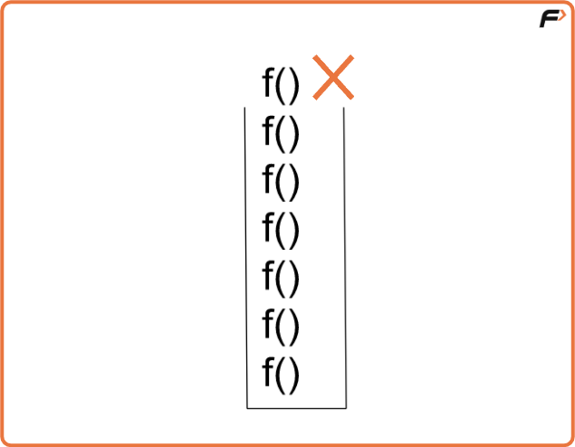
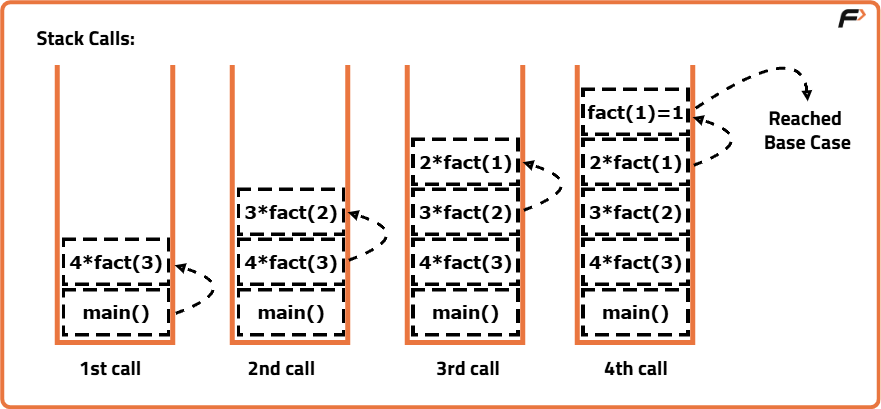
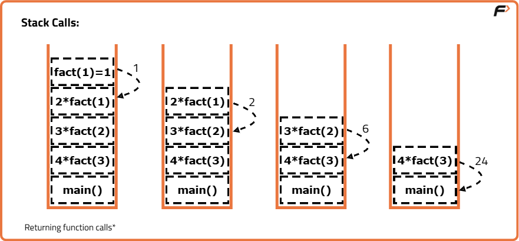
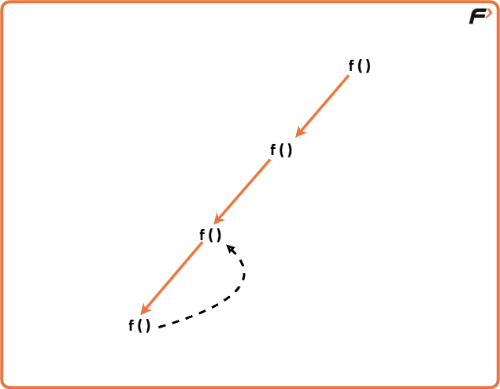

Introduction to Recursion - Understand Recursion by printing something N times

What is Recursion?
Recursion is a programming technique where a function calls itself directly or indirectly to solve a problem, by breaking it down into smaller subproblems until it reaches a base case that stops further calls.

Let’s understand recursion with the help of an illustration :

As we can see in the above image, a function is calling the same function inside its body. Since there is no condition to stop the recursive calls, the calls will run indefinitely until the stack runs out of memory (stack overflow ).

---

What is Stack Overflow in Recursion?
Whenever recursion calls are executed, they’re simultaneously stored in a recursion stack where they wait for the completion of the recursive function. A recursive function can only be completed if a base condition is fulfilled and the control returns to the parent function.

But, when there is no base condition given for a particular recursive function, it gets called indefinitely which results in a Stack Overflow i.e, exceeding the memory limit of the recursion stack and hence the program terminates giving a Segmentation Fault error.

The illustration above also represents the case of a Stack Overflow as there is no terminating condition for recursion to stop, hence it will also result in a memory limit exceeded error.

---

Base Condition
It is the condition that is written in a recursive function in order for it to get completed and not to run infinitely. After encountering the base condition, the function terminates and returns back to its parent function simultaneously.

To get a better understanding of how the base condition is an integral part of recursive functions, let us see an example below :

According to the images, the function will decrement and will keep calling itself until it reaches 1. Once it reaches 1, it starts returning values one by one in recursion stack.

---

Recursive Tree
A recursive tree is basically a representative form of recursion which depicts how functions are called and returned as a series of events happening consecutively. It is a pictorial description of the process of recursion as illustrated below :

When a recursive call gets completed, the control returns back to its parent function which is then further executed until the last function waiting in the recursive stack returns.

---

Advantages of Recursion
Simplifies code: Complex problems can be solved in fewer lines of code compared to iterative solutions.
Natural representation: Problems that are recursive in nature (like tree traversals, factorial, Fibonacci, etc.) are easier to express.
Reduces code complexity: Avoids writing nested loops, making the logic more readable and elegant.
Useful in divide-and-conquer algorithms: Essential for algorithms like QuickSort, MergeSort, Binary Search, and Dynamic Programming.

---

Disadvantages of Recursion
High memory usage: Each recursive call adds a new layer to the function call stack, which may lead to memory overhead.
Risk of stack overflow: Without proper base cases, infinite recursion can occur and crash the program.
Slower execution: Function calls and returns add extra overhead compared to simple loops.
Harder to debug: Tracing recursive calls can be confusing, especially in deep recursion.