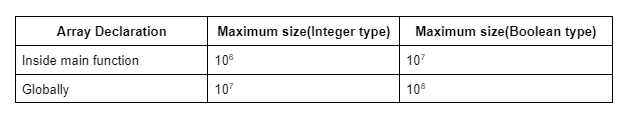
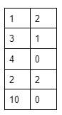
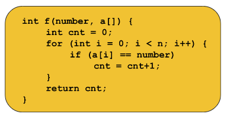
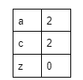
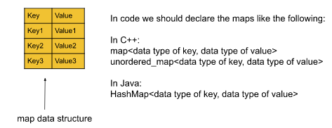

Hashing | Maps | Time Complexity | Collisions | Division Rule of Hashing | Strivers A2Z DSA Course

Hashing:
Let’s first try to understand the importance of hashing using an example:

Given an array of integers: [1, 2, 1, 3, 2] and we are given some queries: [1, 3, 4, 2, 10]. For each query, we need to find out how many times the number appears in the array. For example, if the query is 1 our answer would be 2, and if the query is 4 the answer will be 0.

Similarly, the following will be the answers to the given queries:

Brute Force approach:
As we have learned the ‘for loop’, the first approach that should come to our mind is to use it to solve this problem. For each query, we will iterate over the array using a loop. We will count the number of times the query number appears in that array i.e. increment the counter variable if the array element at that index equals the query number. In terms of function, it will look like the following:

Now, for each query, we will call the function and it will return the number of times the given query appears in the array.

Time Complexity analysis of the function:
We have learned how to compute the time complexity of any code. The above function contains a for loop that runs for N times. So, the time complexity of the function will be O(N) ignoring the other constant operations.

Now, for each query, we are calling this function. So, if the query contains 5 numbers and we call the function 5 times, the total time complexity will be O(5*N). If the number of queries is Q, the time complexity will be O(Q*N).

Now, if the length of the query becomes large like 105 and the array size also becomes large like 105, the time complexity will be O(1010).

We know from our previous knowledge that 108 operations take 1 second to get executed. So, 1010 operations will take around 100 seconds(1010/108). We cannot say a code is good if it takes 100 seconds to get executed.

Optimized approach using Hashing:
Definition of Hashing:
In order to optimize this approach, we need to use hashing. If we say the definition of hashing in a naive way, it is nothing but the combination of the steps, pre-storing, and fetching.

Now, let’s understand how to solve the given problem using the two steps:
Assumption: We are assuming that the maximum element in the given array can be 12.

Step 1 - Pre-storing: In this step, we will create an array(named hash array) of size 13(so that we can get the index 12) initialized with 0. In this hash array, we are going to store the frequency of each element(i.e. The number of times each element appears in the array) of the given array. To do so, we will iterate over the given array, and for each element arr[i], we will do hash[arr[i]] += 1. After completing this process the hash array will look like the following:

This step is named pre-storing as we are pre-calculating the information about the element of the array before answering the queries.

Step 2 - Fetching: In this step, we will select each query i.e. the number and for the query, we will just fetch the value of hash[number] and return it instead of running a ‘for loop’ every time.

The implementation is given below:

Code:

Java
import java.util.*;

class tUf {

    public static void main(String[] args) {
        Scanner sc = new Scanner(System.in);

        int n;
        n = sc.nextInt();
        int[] arr = new int[n];
        for (int i = 0; i < n; i++) {
            arr[i] = sc.nextInt();
        }

        //precompute:
        int[] hash = new int[13];
        for (int i = 0; i < n; i++) {
            hash[arr[i]] += 1;
        }

        int q;
        q = sc.nextInt();
        while (q-- != 0) {
            int number;
            number = sc.nextInt();
            // fetching:
            System.out.println(hash[number]);
        }
    }
}
Input:

5
1 3 2 1 3
5
1 4 2 3 12

Output:

2
0
1
2
0

Point to remember:
We may encounter a problem where the maximum array element may be very large like 109. In that case, theoretically, we should declare an array of size 109+1. But we cannot do so. The maximum size of an array can be the following:

Note: So, with this method, we can solve the problems where the array is within a specific size. We are going to discuss later in the article, how we can overcome this limitation of the specific size.

Until now, we have learned the number hashing. Now, let’s discuss the character hashing.

Character Hashing:
Given the string: “abcdabefc” we are given some queries: [a, c, z]. For each query, we need to find out how many times the character appears in the string. For example, if the query is ‘a’ our answer would be 2, and if the query is ‘z’ the answer will be 0.

Similarly, the following will be the answers to the given queries:

Brute Force approach:
It is similar to the previous problem. Here, for each query, we will iterate over the string using a for loop and will count the number of times the character appears in that string i.e. increment the counter variable if the character at that index of the string equals the given character. In terms of function, it will look like the following:

Now, for each query, we will call the function and it will return the number of times the given character appears in the string.

Time Complexity analysis of the function:
It is as same as the one we calculated for the previous problem. If the number of queries is Q, the time complexity will be O(Q*N) where N = size of the string.

Optimized approach using Hashing:
In number hashing, each index of the hash array represents an element in the given array. So, somehow, we need to map the characters of the string to an integer so that we can represent them using the indices of the hash array. So, let’s discuss the mapping technique:

Mapping characters to integers:
In order to map the characters we need to use the ASCII values of the respective characters. The ASCII value of lowercase a is 97. So, if we write int x = ‘a’, it will typecast the character, ‘a’, into the ASCII value, 97, and store it in the variable x instead of throwing an error. So, similarly, if we write hash[‘a’], it will signify hash[97].

Now, we can do the mapping more efficiently for specific cases like the following:

Case 1 - If the string contains only lowercase letters: In this case, we can map the characters like:

‘a’ -> 0, ‘b’ -> 1, ‘c’ -> 2,....., ‘z’ -> 25.
In order to get the corresponding value for a character, we will use the following formula:

corresponding value = given character - 'a'

For example, if the given character is ‘f’, we will get the value as (‘f’ - ‘a’) = (102-97) = 5.  Here, we can easily observe that the maximum value can be 25.

So, for character hashing in this case, we need a hash array of size 26. And while pre-storing we will do hash[s[i]-’a’] += 1 instead of hash[arr[i]] += 1, and while fetching we will do hash[character-’a’] instead of hash[number]. The rest of the methods will be as same as in the case of number hashing.

Case 2 -  If the string contains only uppercase letters: In this case, we can map the characters like:

‘A’ -> 0, ‘B’ -> 1, ‘C’ -> 2,....., ‘Z’ -> 25.
In order to get the corresponding value for a character, we will use the following formula:

corresponding value = given character - 'A'

Then the process will be similar to case 1.

Case 3 - If the string contains both uppercase and lowercase letters: We have 256 characters in total in this case. So, we will create a hash array of size 256. We will not subtract anything from the given character and will use the character as it is, to access the hash array while pre-storing and fetching. For pre-storing hash[s[i]] += 1 and for fetching we will use hash[character] only. The rest of the process will be exactly the same as in the number hashing.

Note: The case 3 method also applies to case 1 and case 2. In character hashing, the limit will not cross 256 and so we will always use this method.

The implementation is given below:

Code if the string contains only lowercase:

Code:

Java
import java.util.*;

class tUf {

    public static void main(String[] args) {
        Scanner sc = new Scanner(System.in);

        String s;
        s = sc.next();

        //precompute:
        int[] hash = new int[26];
        for (int i = 0; i < s.length(); i++) {
            hash[s.charAt(i) - 'a']++;
        }

        int q;
        q = sc.nextInt();
        while (q-- > 0) {
            char c;
            c = sc.next().charAt(0);
            // fetch:
            System.out.println(hash[c - 'a']);
        }
    }
}
Input:

abcdabehf
5
a
g
h
b
c

Output: 2
0
1
2
1

Code if the string contains both uppercase and lowercase:

Code:

Java
import java.util.*;

class tUf {

    public static void main(String[] args) {
        Scanner sc = new Scanner(System.in);

        String s;
        s = sc.next();

        //precompute:
        int[] hash = new int[256];
        for (int i = 0; i < s.length(); i++) {
            hash[s.charAt(i)]++;
        }

        int q;
        q = sc.nextInt();
        while (q-- > 0) {
            char c;
            c = sc.next().charAt(0);
            // fetch:
            System.out.println(hash[c]);
        }
    }
}
Input:
abcdabehf
5
a
g
h
b
c

Output:
2
0
1
2
1

How to hash large numbers like 109 or higher:
Until now, we have learned the method of number hashing but using this method we cannot hash large numbers like 109 or higher. We can solve this problem using the STL map and unordered_map in C++ or the HashMap in Java collection. Now, we are going to discuss these concepts in detail and most of the concepts are the same in map/unordered_map(in C++) and HashMap(in Java).

map and unordered_map in C++ / HashMap in Java:

Let’s understand the concepts considering the same example, we have used before, in the case of number hashing.

The data structure looks like the following:

Key: In a map, a key refers to the element, for which we want to store information. We can access the value of a key using the key itself like mp[key].

Value: Value refers to the information stored corresponding to a key.

In our example, we want to store the frequency(i.e. How many times an element appears in the array) of each element of the given array. So, here each element of the array will be the key of the map and frequencies will be the value corresponding to the keys. In terms of code, it will look like the following:

Difference between map and unordered_map in C++:

Difference between array hashing and hashing using the map:
Let’s understand the difference considering the array: [1, 2, 3, 1, 3, 2, 12]. Here, the maximum element of the array is 12. So, if we apply array hashing, we need an array of size 13. But if we apply the map data structure, it will be the following:

Note: If we want to fetch the value of a key that does not exist in the map, the map will always return 0 in C++ and null in Java.

Code:

Java
import java.util.*;

class tUf {

    public static void main(String[] args) {
        Scanner sc = new Scanner(System.in);

        int n;
        n = sc.nextInt();
        int[] arr = new int[n];
        for (int i = 0; i < n; i++) {
            arr[i] = sc.nextInt();
        }

        //precompute:
        HashMap<Integer, Integer> mp = new HashMap<>();
        for (int i = 0; i < n; i++) {
            int key = arr[i];
            int freq = 0;
            if (mp.containsKey(key)) freq = mp.get(key); // fetching from the map
            freq++;
            mp.put(key, freq); // inserting into the map
        }

        // Iterate over the map:
        /*
        for (Map.Entry<Integer, Integer> it : mp.entrySet()) {
            System.out.println(it.getKey() + "->" + it.getValue());
        }
        */

        int q;
        q = sc.nextInt();
        while (q-- > 0) {
            int number;
            number = sc.nextInt();
            // fetch:
            if (mp.containsKey(number)) System.out.println(mp.get(number));
            else System.out.println(0);
        }
    }
}
Input:
7
1 2 3 1 3 2 12
5
1 2 3 4 12

Output:
2
2
2
0
1

Note: We can similarly perform character hashing using the map data structure.

The syntax will be the following:

Time complexity of map data structure:
The total time complexity will be O(N * time taken by map data structure).

Storing(i.e. insertion) and fetching(i.e. retrieval) in a C++ map, both take always O(logN) time complexity, where N = the size of the map.

But the unordered_map in C++ and HashMap in Java, both take O(1) time complexity to perform storing(i.e. insertion) and fetching(i.e. retrieval). Now, it is valid for the best case and the average case.

But in the worst case, this time complexity will be O(N) for unordered_map. Now, the worst case occurs very very rarely. It almost never happens and most of the time, we will be using unordered_map.

Note: Our first priority will be always to use unordered_map and then map. If unordered_map gives a time limit exceeded error(TLE), we will then use the map.

The time complexity in the worst case is O(N) because of the internal collision.

In order to understand collision properly, we need to understand the concept of how the hashing work with an optimized space.

What is collision & How the hashing works:
Hashing is done using several methods. Among them, the three most common ones are

Division method
Folding method
Mid-Square method
Here, we are only interested to discuss the division method. The rest two methods may be important for college exams but not much important in terms of interviews or coding rounds.

The map data structures in the C++ STL or in Java are implemented using different and complex methods. We need not know about them. But here we are going to discuss the division method so that we can understand the collision properly.

Division Method:
Let’s discuss it considering the following example:

Assume, we are given an array: [2, 5, 16, 28, 139]. Here, we can apply array hashing, and to use that, we need to create an array of size 140. Now, what to do if we are given a constraint that we cannot use an array whose length is greater than 10?

In order to solve this we will use the division method. We will simply consider the modulo 10 of each element of the array(element % 10) and we will hash(pre-store and fetch) the elements on the basis of the modulo value i.e. the remainder. The steps will look like the following:
Pre storing: hash[arr[i]%10] += 1 and Fetching: hash[number%10]

Now if we apply this method to the given array, the hash array will look like the following:

This is how the division method works. We simply reduce the array elements and apply array hashing.

Let’s discuss the questions that come up in the mind:

Question: What if two or more array elements give the same remainder for modulo 10?
In this case, we apply the linear chaining method. This method is implemented using Linked List which will be discussed later in another article. Here, we just need to understand the logic. While storing the elements we will maintain a chain(i.e. inserting the element itself to the corresponding index instead of just keeping the count) for each index(i.e. the remainder we get). And in that chains, we will store the elements in a sorted fashion.

Let’s understand it considering the following example:

Given array: [2, 5, 16, 28, 139, 38, 48, 28, 18]

In this array 28, 38, 48, and 18 are giving the same value for modulo 10. So, we will apply linear chaining. The hash array will look like the following:

Now to get the frequency of a number, we will first go to (number % 10) indexed chain and count the frequency of that number.

Note: We can choose to take modulo of any number as per our need. Here for example we have taken the number 10.

Collision:
Now, if we are applying linear chaining and division rule and we find that all elements of an array get stored in a single index, then we will call it a case of collision.

Example:

Given array: [8, 18, 28, 38, 48, 58, 68, ….., 1008]
If we apply the methods and take modulo 10 for every number, the hash array will look like the following:

Now, while fetching we have to traverse N times(N = size of the given array) to find the frequency of an element. This is when the worst case happens and the time complexity becomes O(N). But this happens very very rarely.

Whatever method the map is using, if all the elements go to the same hash index, we will call it a case of collision.

Note: In the map data structure, the data type of key can be anything like int, double, pair<int, int>, etc. But for unordered_map the data type is limited to integer, double, string, etc. We cannot have an unordered_map whose key is pair<int, int>.
